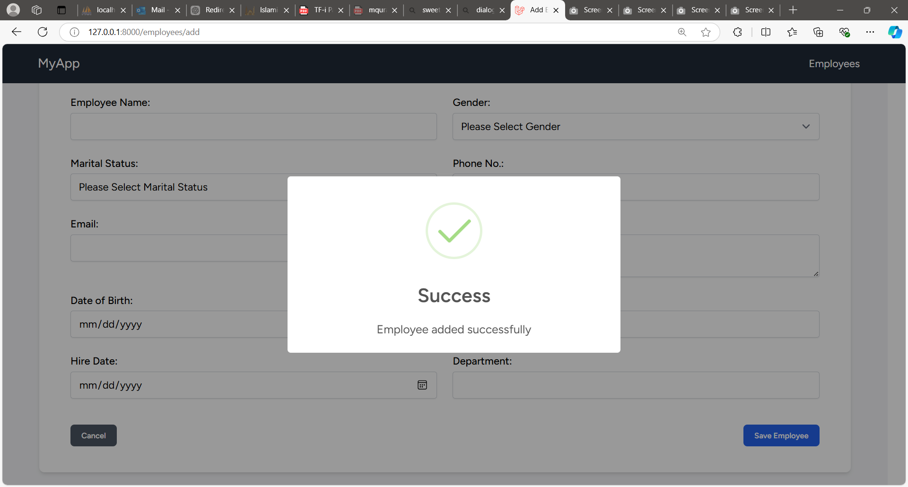

# PHP coding test

Simple php test to create and display employee profile

## Follow these steps
1. Fork this repository into your GitHub account (You can create a GitHub account if you don't have one)
2. Clone the repository from your repository
3. Checkout main branch
4. Commit your changes with the code for below question
5. Upload screen interface as image
6. Add ```MYwavePSSD``` as collaborators

## Task
1. Create a form to add new employee

    ```
    Employee Name
    Gender
    Martial Status
    Phone No.
    Email
    Address
    Date of birth
    Nationality
    Hire Date
    Department
    ```
    - You can add any other field that is relevant.
    - Add validation to the input for both frontend and backend
    - Implement REST API to pass data
    - After validation, if form is valid, save into json or csv

2. Show all employee profile pulled from json or csv in a new screen

## Language
- Frontend
    - Normal HTML5 and css or REACT 

- Backend
    - Normal PHP or LARAVEL

## BONUS POINT

- Clean code and good practise
- Good UI UX


# Project Name
Interview Question
## Overview

Interview Question.

## Installation

Follow the steps below to set up the project locally.

### Install Composer Dependencies

Run the following command to install the PHP dependencies:

```bash
composer install
cp .env.example .env
php artisan key:generate
php artisan migrate
npm install
npm run dev
php artisan serve
```

## Visit website 
Go to http://127.0.0.1:8000/employees/list

### First Page
This is page to list all employee


## Add Employee Page
After click "Add Employee", Page will be display Add Employee Page

## Error add Employee Page
User need to fill in all information before can submit.

## Success add Employee Page
A success message will be display if user successfully added.

## List Employee Page
All employe will display in Employee List page.

## Modal Detail Employee Page
Click Employee to dislay all information about employee
